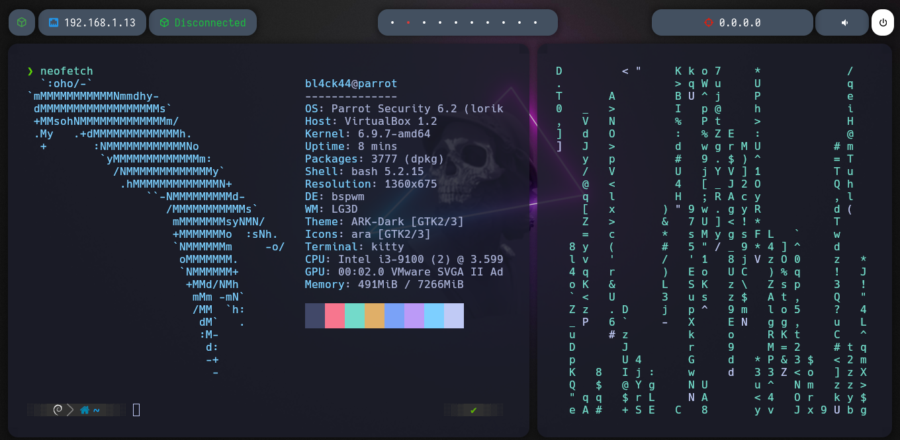

# Bspwm Parrot

1.- Uso del Script

git clone https://github.com/bl4ck44/Bspwm.git

cd Bspwm

sudo chmod +x install.sh

./install.sh

2.- Wallpaper

El wallpaper de esta alojado en una carpeta Wallpaper que se crea en nuestro HOME.

La configuración del mismo es al gusto.

**CREDITOS:** xJackSx, s4vitar

https://github.com/xJackSx/BSPWMparrot

https://github.com/s4vitar

