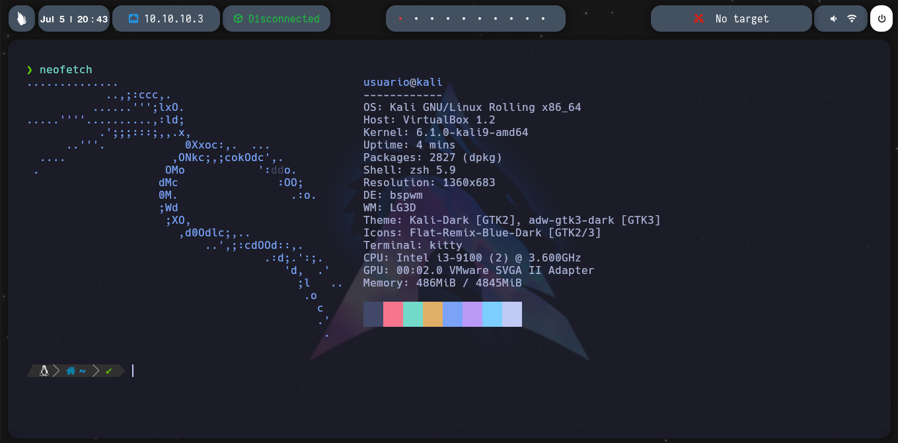
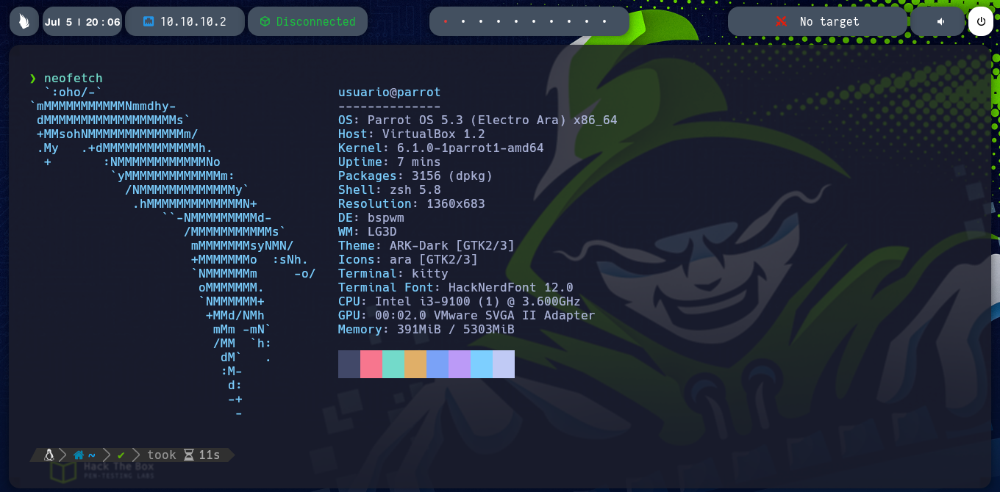

# Bspwm

Bspwm es un gestor de ventanas para sistemas operativos basados en Unix, como Linux. "BSPWM" es un acrónimo de "Binary Space Partitioning Window Manager". Este gestor de ventanas utiliza la técnica de particionado binario para organizar y gestionar las ventanas en el escritorio.

Bspwm es conocido por ser extremadamente liviano y altamente personalizable. No incluye muchas de las características y decoraciones visuales de otros entornos de escritorio, lo que permite a los usuarios tener un mayor control sobre el manejo de sus ventanas y el flujo de trabajo en general.


### **Kali Linux**

```
git clone https://github.com/bl4ck44/Bspwm.git

cd Bspwm

cd Kali-Linux

sudo chmod +x install.sh

cd ..

bash setup.sh
```

<p align="center">

</p>

### **Parrot OS**

```
git clone https://github.com/bl4ck44/Bspwm.git

cd Bspwm

cd Parrot-OS

sudo chmod +x install.sh

cd ..

bash setup.sh
```

<p align="center">

</p>